our target ip was : 10.130.145.49
the questions they gave us to answer : 
	1. scan and find open ports.
	2. Who wrote the task list?
	3. What service can you bruteforce with the text file found?
	4. What is the users password?
	5. user flag user.txt.
	6. root flag root.txt.

so i run nmap to see the open ports.

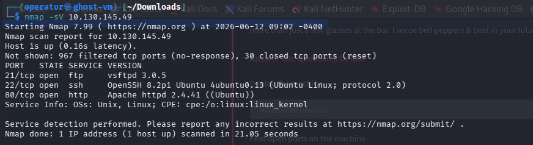

so in the result we see http port open that means there is a website so when i see it.

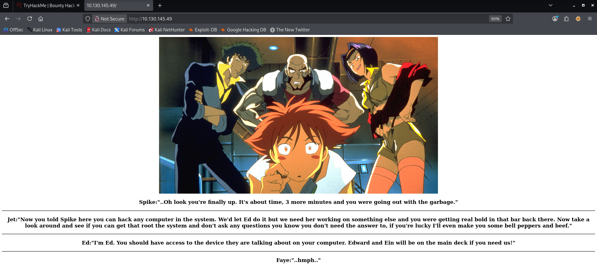

it didn't have much it just a conservation, but THM give us hint to go to the ftp service in anonymous.

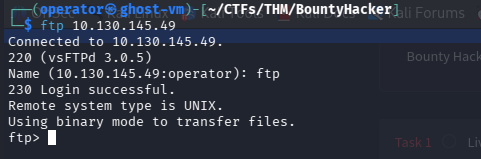
 
and in the name part you can write "ftp" or "anonymous" i used "ftp" but two of them work.

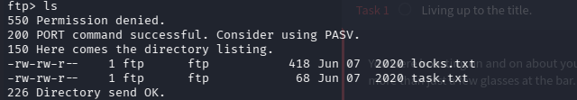

now when i ls i see 2 file called "locks.txt" & "task.txt".

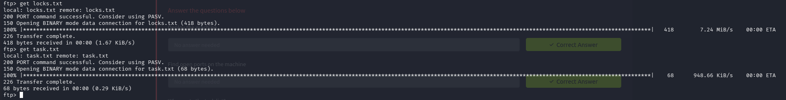

and used get command to download them and they will be downloaded to the current directory you are in.

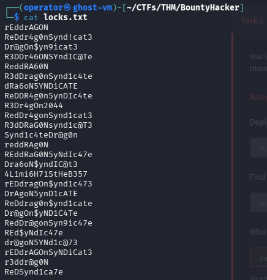

when i see inside the locks.txt file it look like worklist/payload for password & keep it for later.

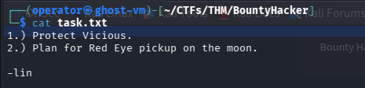

and the task.txt have like instructions and the writer was "lin" so we got our 2nd question answer.
so now b/c post 22 or ssh is open we can brute force by that and also that was the 3rd question answer.

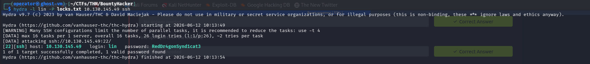
the command used is this : 
```bash
hydra -l lin -P locks.txt 10.130.145.49 ssh
```

used hydra tool to brute force and the username is "lin" the writer and used the wordlist "locks.txt" we downloaded from the ftp server and got the passwd also that was the 4th question answer.

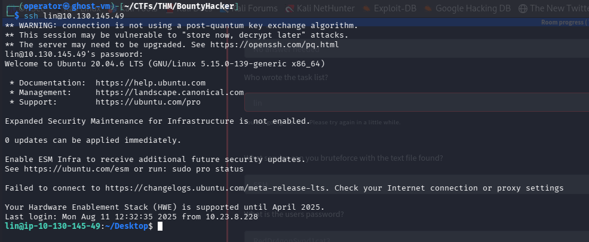
we successfully login with those credentials.  
when i ls inside /Desktop directory.

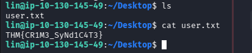
i got file named "user.txt" and inside that i got the  5th question & user flag.
to privilege escalate first i serach what can i run using sudo power using this command : `sudo -l`

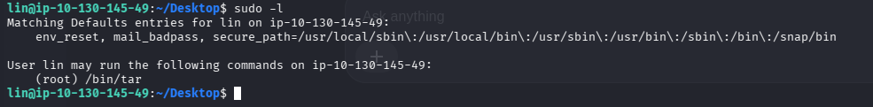

and i can tar command using sudo privilege so search how to privilege escalate using tar command and this command to execute :  
```bash
sudo tar -cf /dev/null /dev/null --checkpoint=1 --checkpoint-action=exec=/bin/sh
```

so i executed the command.

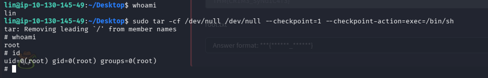

and now we got the root user.
when i go to the /root directory and ls there.

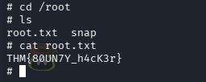

i see a file name called "root.txt" and inside it we got the last 6th question & the root Flag so Done.

and Thanks for reading my write-up & it's a great room try it out.
Good bye, see you in another room!!!