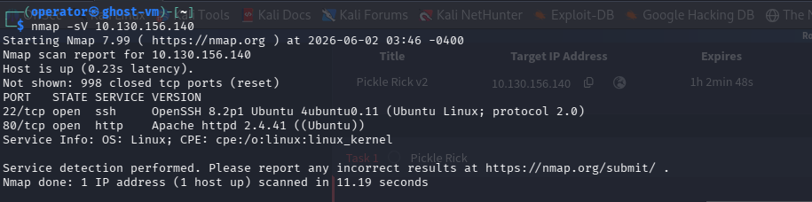
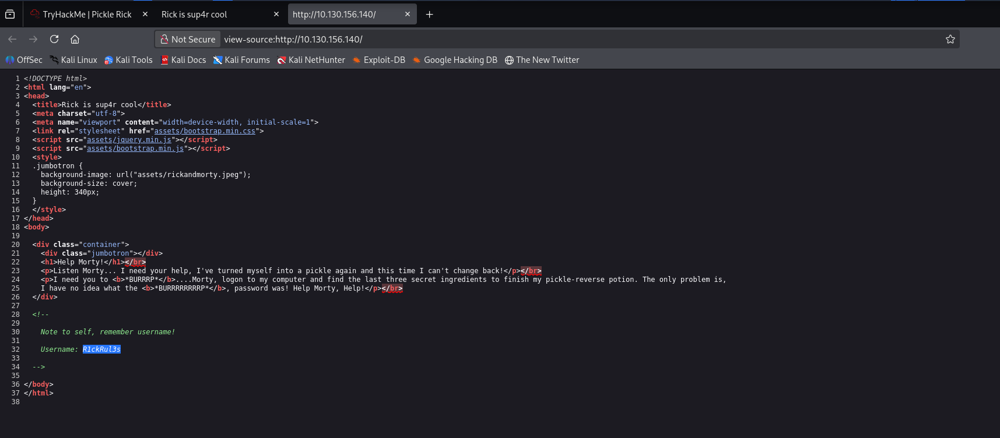
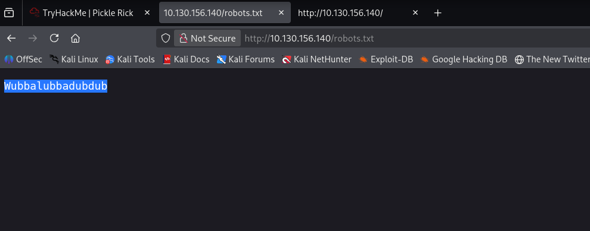
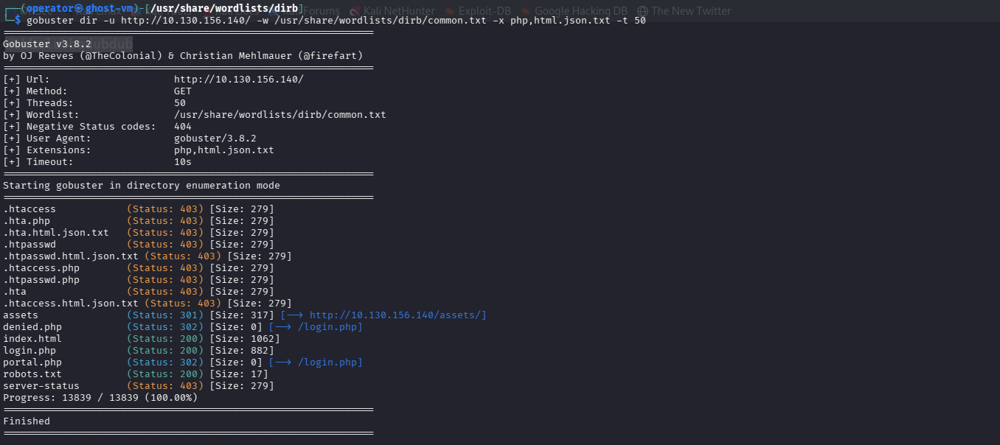
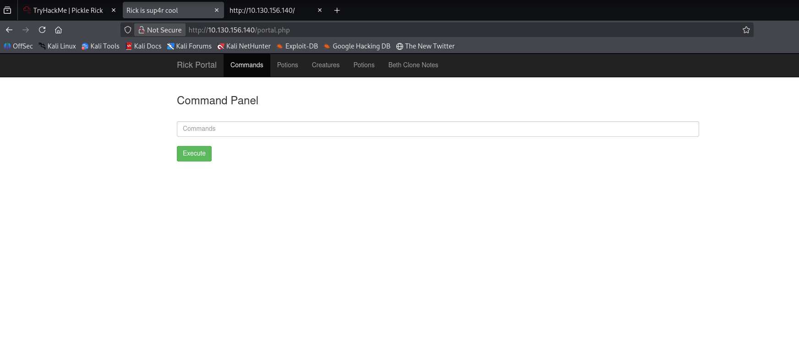
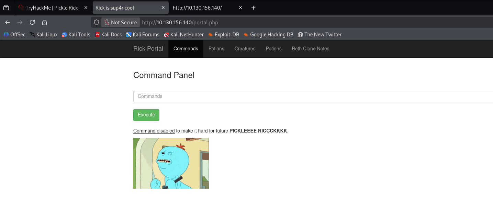
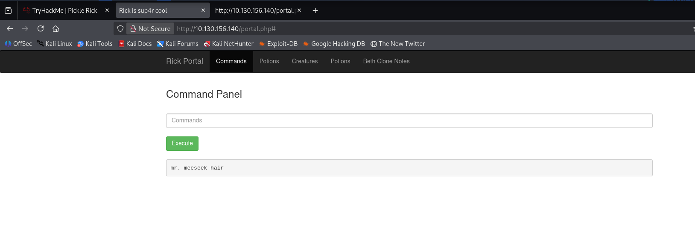
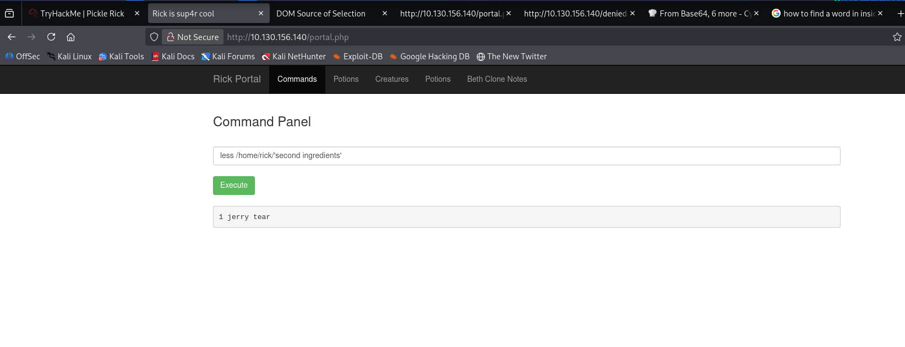
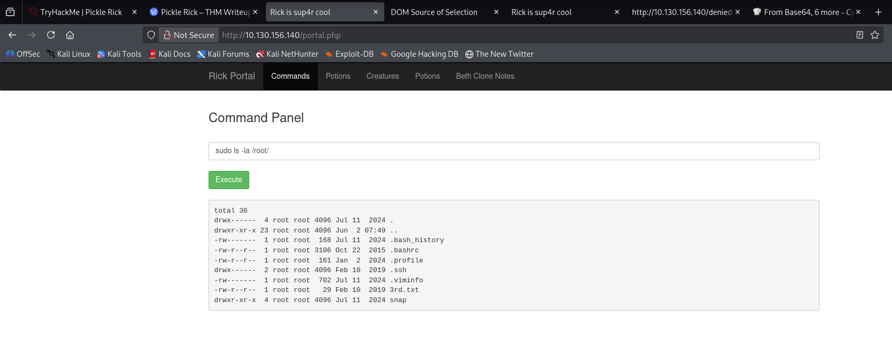
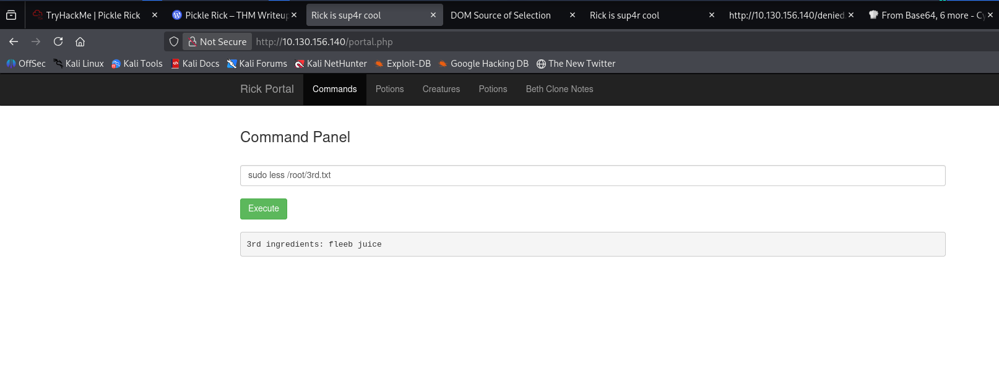

The Target ip was :- 10.130.156.140

so i run port scan with namp.

i got the result 2ports are open port 22 & 80.

i see the webserver but it didn't have much in the front but in the page source we got something interesting a username.

so now i checked the robots.txt directory if i can find something 

and it gave the word : "Wubbalubbadubdub" so i saved it to later.
so now i run a tool called **gobuster** so i can find other directories. used this wordlist : "/usr/share/wordlists/dirb/common.txt".

i watched to the /assets directory but noting interesting there, but there are 2 results if you search for /denied.php or /portal.php they will redirect you to /login.php. so let's check it.

we got the login page and we got in by the username we got before & password from the /robots.txt file.
now this is command panel is like a shell we can write our commands and execute them.

when we ls we got a file name : "Sup3rS3cretPickl3Ingred.txt" 

when we see what inside the file it told us **cat** command is disabled so we use **less** command to see inside it. we got our first Flag there.

now when we see inside clue.txt file it told us to watch inside the file system.
when i ls in the /home directory i got /rick directory when i ls that i got a file named : 
'second ingredients''. 

when i see inside that file i got the 2nd Flag.

for the 3rd we don't have any clue so after i search a lot of places i go to the /root directory and ls i see a file name called "3rd.txt".

and guess what, i got the 3rd Flag there DONE.

This was my first room write-up and it was nice room.

Good bye, see you in another room!
