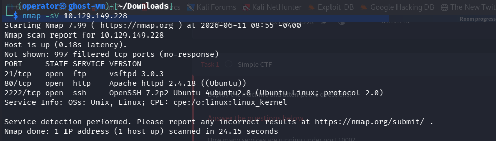
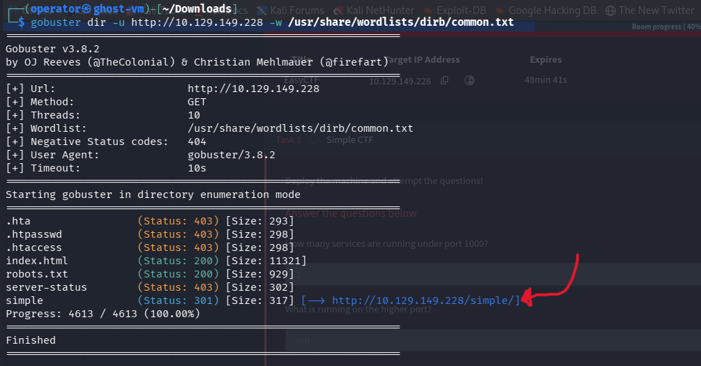
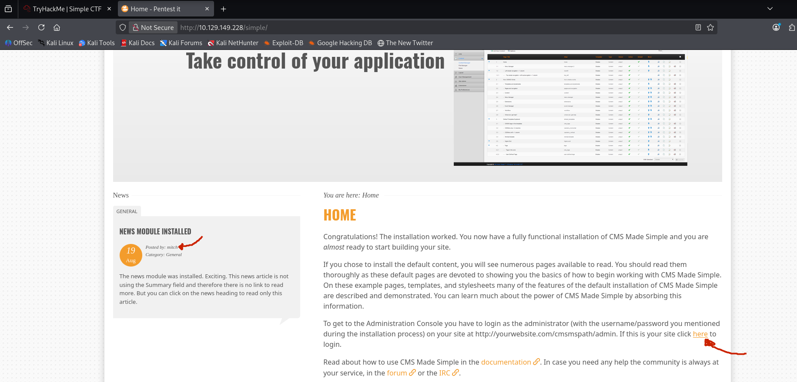
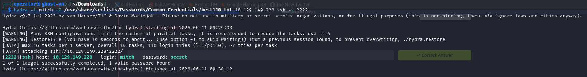
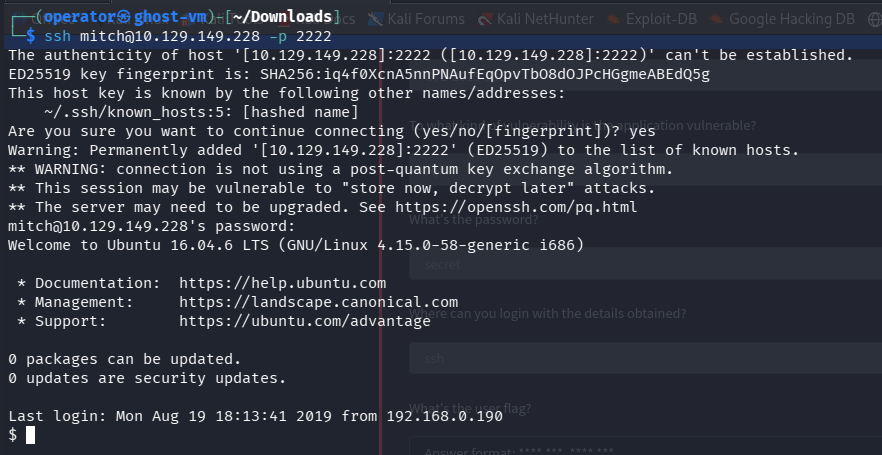
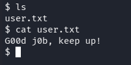
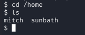
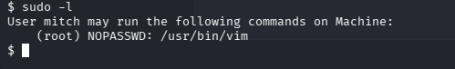
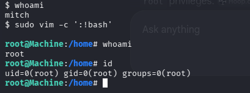
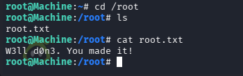

The target ip was : 10.129.149.228.
the questions they gave us to answer : 
	1. How many services are running under port 1000?
	2. What is running on the higher port?
	3. What's the CVE you're using against the application?
	4. To what kind of vulnerability is the application vulnerable?
	5. What's the password?
	6. Where can you login with the details obtained?
	7. What's the user flag?
	8. Is there any other user in the home directory? What's its name?
	9. What can you leverage to spawn a privileged shell?
	10. What's the root flag?

so now first i run a port scan using nmap.



and we got the first 2 questions answer there, & also got the 3rd question answer CVE by searching in exploitdb [here](https://www.exploit-db.com/exploits/46635), it is an SQL injection type and that means we got the 4tf question.

i used gobuster to find other directory and got /simple directory.



in the web i see there a name it may be a username b/c THM didn't gave us a username just asked for password we save it for later. 



 as i said i got the exploit script from Exploitdb but it python2 script and it need's some library's to be downloaded &  i tried a lot but didn't work so when i search and read some write-ups i got anther thing. THM just say use the exploit and get in and the 6th question is where so the person used his same password in two places.

since i know the username from /simple directory from the website but i don't have the password i used tool called hydra for brute force.


used this command :
```bash
hydra -l mitch -P /usr/share/seclists/Passwords/Common-Credentials/best110.txt  10.129.149.228 ssh -s 2222
```

so we cracked the passwd and will login by ssh & also we got our 5th & 6th question answer here.



now we are inside and have to find user Flag.


when we ls we got a file named called "user.txt" and we got the 7th question answer & user Flag.



so now for the 8th question i just go to /home directory and ls i got another user named "sunbath" and that is the answer.

i used this command 



```bash
sudo -l
```
what it does is what commands i am allowed to run using sudo, so i got vim editor and i can run vim using sudo & also we got our 9th question answer here. 
so you run `sudo vim` and got to vim and run/execute this command using colon ":" at bigging :  
```bash 
:!bash
```

or without going to vim in the terminal by this command : 
```bash
sudo vim -c ':!bash'
```


i used the 2nd option and got to the root user.
now i just do to the /root directory and ls there i see a file named called "root.txt".



and when i see inside it i got the 10th question & the root Flag so it's DONE.

and Thanks for reading my write-up & it's a great room try it out.
Good bye, see you in another room!!!